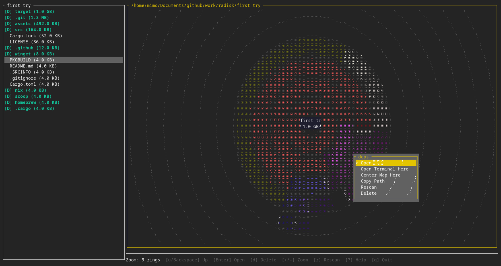
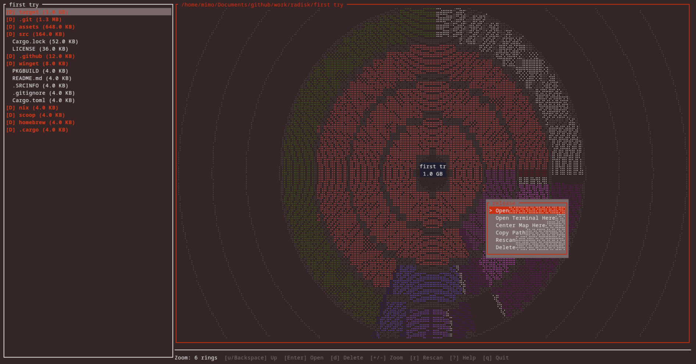
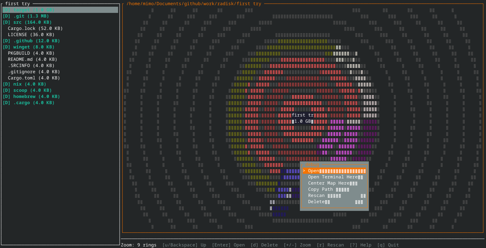

# RaDisk

> Terminal-based radial disk usage visualizer inspired by KDE FileLight.
> Fast (parallel scanner, 9–14× ncdu on a warm cache), configurable
> (TOML config, rebindable keys), and snapshot-friendly (`.radisk`
> files round-trip across machines).

[](https://github.com/mimobn/radisk/actions)
[](https://crates.io/crates/radisk)
[](https://aur.archlinux.org/packages/radisk)
[](LICENSE)
[](https://ko-fi.com/mimobn_)

## What is RaDisk?

RaDisk is a TUI disk-usage analyzer. It draws an interactive radial
sunburst of your filesystem with full mouse and keyboard support, and
also offers an ncdu-style indented tree view for users who prefer
density over visualization.

The scanner is parallel (jwalk + rayon) and streams progress to the UI
as it runs, so big trees never freeze the screen.

| target              | files   | radisk     | speedup vs the legacy walker |
| ------------------- | ------- | ---------- | ---------------------------- |
| `/usr/share`        | 215,039 | 0.20 s     | 9.6× |
| `/usr/lib`          | 181,730 | 0.19 s     | 13.5× |
| `~/.cargo`          |  15,166 | 0.027 s    | 12.3× |

`cargo run --release --example bench_scan -- <path>` reproduces the
benchmark on your own hardware.

## Screenshots





## Quick links

* [Installation](#installation)
* [Usage](#usage)
* [Keyboard shortcuts](#keyboard-shortcuts)
* [Configuration](#configuration)
* [Snapshots & diff](#snapshots--diff)
* [Building from source](#building-from-source)
* [Architecture](ARCHITECTURE.md) · [Snapshot format](docs/SNAPSHOT_FORMAT.md) · [Changelog](CHANGELOG.md)

## Installation

> Tested primarily on Arch Linux. Other distros and platforms should
> work; please open an issue if they don't.

The binary is named `radisk`.

**Arch Linux (AUR)**

```sh
yay -S radisk
```

**Quick install (macOS / Linux)**

```sh
curl -sSf https://raw.githubusercontent.com/mimobn/radisk/main/install.sh | sh
```

Installs Rust if it isn't present and drops the binary in
`~/.radisk-install/bin`.

**Cargo (crates.io)**

```sh
cargo install radisk
```

**Pre-built archives** for Windows / macOS / Linux are attached to
each [release](https://github.com/mimobn/radisk/releases).

## Usage

```sh
radisk                              # scan the current directory
radisk /home/user                   # scan a specific directory
radisk -d 6 /var                    # scan with 6 ring levels
radisk --exclude node_modules ~/    # skip a path glob
radisk --config ./my-config.toml /  # use an explicit config file
radisk --export snap.radisk /usr    # headless scan + write a snapshot
radisk --import snap.radisk         # open a snapshot, no scan
radisk --mounts                     # partition-style picker before scanning
radisk diff a.radisk b.radisk       # compare two snapshots, stdout
radisk --help                       # full CLI surface
```

## Keyboard shortcuts

| Key | Action |
| --- | --- |
| `q` / `Esc` | Quit |
| `?` | Show help overlay |
| `u` / `Backspace` | Go to parent directory |
| `Enter` | Open hovered folder |
| `+` / `=` | Zoom in (more rings) |
| `-` | Zoom out (fewer rings) |
| `r` | Rescan |
| `d` | Delete (sends to trash if `trash-put` / `gio trash` is installed) |
| `Tab` | Toggle focus (map ↔ sidebar) |
| `v` | Toggle view (radial ↔ tree ↔ largest-files) |
| `Shift+S` | Cycle sort (size↓ → size↑ → name) |
| `a` | Toggle apparent vs on-disk size (rescans) |
| `Space` | Toggle item in/out of multi-select |
| `Shift+D` | Delete every selected item (one confirm) |
| `Shift+X` | Clear multi-select |
| `o` | Show package owner (pacman/AUR/dpkg/rpm/apk + npm/pip/uv/cargo/flatpak/snap) |
| `j` / `k` (or `↑` / `↓`) | Navigate up/down in sidebar |

Every key in the table is rebindable from the config file — see below.

### Mouse

| Action | Description |
| --- | --- |
| Left click | Open folder / Navigate |
| Right click | Context menu |
| Scroll | Zoom in/out |
| Hover | Highlight segment / Sync with sidebar |

## Configuration

RaDisk reads `$XDG_CONFIG_HOME/radisk/config.toml` (or the platform
equivalent on macOS / Windows). Every key is optional; missing files
fall back to compiled-in defaults; malformed files surface a parse
error with file:line. A complete annotated example is shipped at
[`docs/config.example.toml`](docs/config.example.toml).

```toml
[display]
ring_depth = 5
sidebar_percent = 25

[scan]
follow_symlinks = false
max_depth = 4096
use_apparent_size = false           # toggle in-app with `a`
exclude = ["node_modules", "**/target/**"]

[keybinds]
quit         = "ctrl+q"
toggle_view  = "v"
cycle_sort   = "shift+s"
# every action in the table above can be remapped here.
```

## Snapshots & diff

`.radisk` snapshots are tiny (the heavy repetition of path strings
makes them compress brilliantly — typically **~650× smaller** than
the data they describe), versioned, and portable across machines.

```sh
# On a server with no display:
radisk --export /tmp/server.radisk /

# On your laptop:
scp server:/tmp/server.radisk .
radisk --import server.radisk

# A week later, see what grew:
radisk --export later.radisk /
radisk diff server.radisk later.radisk | head
# ~ +   2.1 GB    14.3 GB -> 16.4 GB   /var/log
# + +  430 MB         0 B -> 430 MB    /var/cache/pacman/pkg
# - -   18 MB    18 MB -> 0 B          /tmp/old-build
```

Format spec: [`docs/SNAPSHOT_FORMAT.md`](docs/SNAPSHOT_FORMAT.md).

## Building from source

RaDisk compiles with stable Rust 1.85 or newer.

```sh
git clone https://github.com/mimobn/radisk
cd radisk
cargo build --release
./target/release/radisk --version
```

### Test suite

```sh
cargo test            # unit + integration tests (~100 covering scanner,
                      #   snapshot round-trip, keybind parsing, diff, etc.)
cargo clippy --all-targets -- -D warnings
cargo fmt --check
cargo doc --no-deps   # generates ./target/doc/radisk
```

CI (GitHub Actions) runs all four on every push and pull request.

## Project layout

| Module               | Responsibility                                                |
| -------------------- | ------------------------------------------------------------- |
| `scanner_streaming`  | Production walker (jwalk + rayon, streaming `ScanEvent`s)     |
| `scanner`            | Reference single-threaded walker (kept for tests / fallback)  |
| `tree`               | Arena, `File`/`Folder`, `SortMode`                            |
| `radial`, `renderer` | Radial layout math + Braille canvas                           |
| `views`              | `View` enum + tree-view renderer                              |
| `config`, `keybinds` | TOML loader (smart-merge) + chord DSL                         |
| `delete`             | Trash-cli detection + TOCTOU-checked delete                   |
| `snapshot`, `diff`   | `.radisk` export/import + folder-level diff                   |
| `mounts`, `picker`   | Partition-style mount picker (`--mounts`)                     |
| `theme`              | Hex / ANSI user-themable palette from `[colors]`              |
| `ownership`          | Multi-PM ownership (pacman/AUR/dpkg/rpm/apk + npm/pip/cargo/flatpak/snap) |
| `app`, `ui`          | Event loop, ratatui layout, status bar, dialogs               |

Full detail in [`ARCHITECTURE.md`](ARCHITECTURE.md).

## Support

If RaDisk is useful to you, consider buying me a coffee:

[](https://ko-fi.com/mimobn_)

## License

GPL-3.0-or-later — see [LICENSE](LICENSE).
